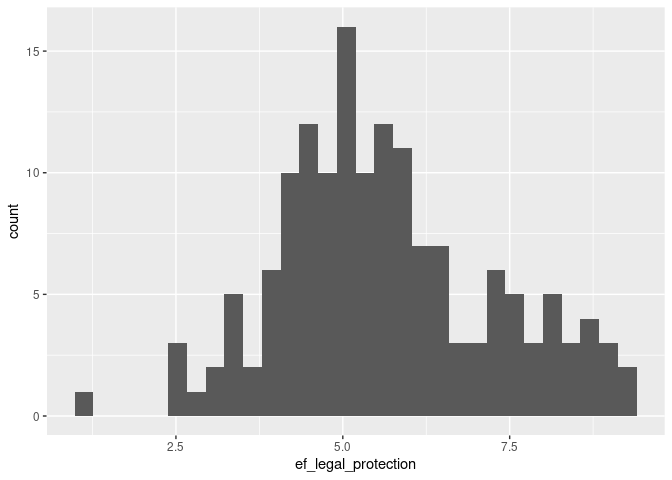
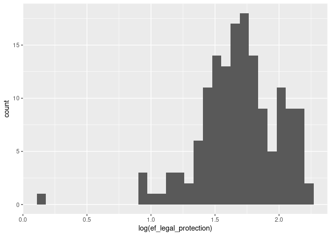
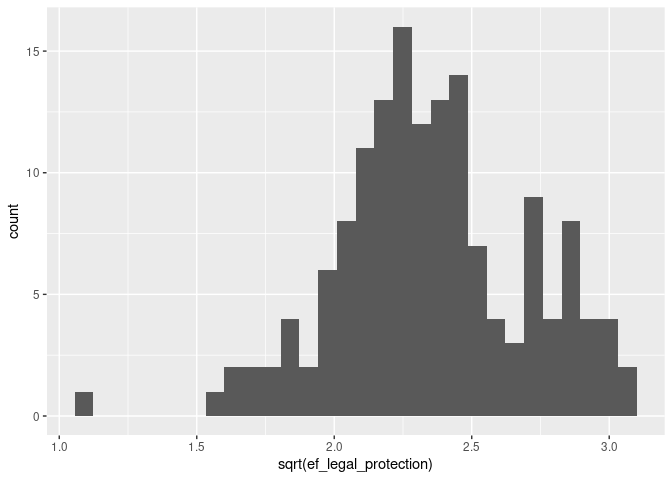
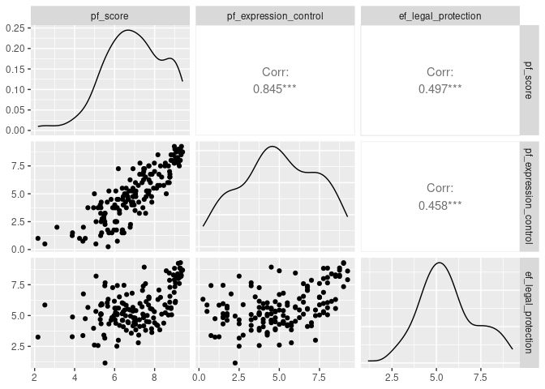
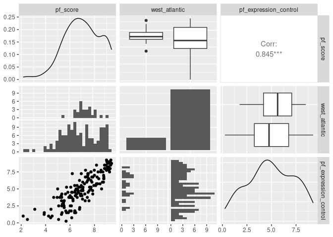
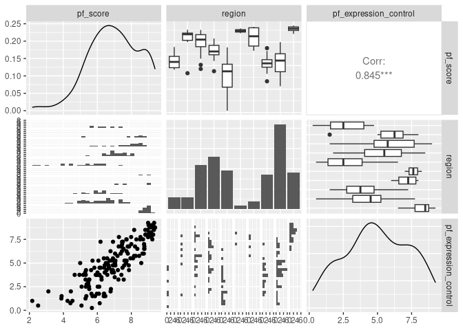

Activity 3 - MLR
================

In the last activity, you might have noticed that I made this Rmd output
a document with a type of `github_document` (in the YAML header
underneath the title - on line 3) instead of a HTML, Word, or PDF
document. This produces a GitHub friendly Markdown file that GitHub then
renders to HTML. You can read more about this output type in RMarkdown’s
[documentation
page](https://rmarkdown.rstudio.com/github_document_format.html) if you
want to learn more.

# Day 1

## Load the necessary packages

I encourage you to continue using the two packages from Posit (formerly
[RStudio](https://posit.co/)): `{tidyverse}` and `{tidymodels}`.
Remember that [Emil Hvitfeldt](https://www.emilhvitfeldt.com/) (of
Posit) has put together a [complementary online
text](https://emilhvitfeldt.github.io/ISLR-tidymodels-labs/index.html)
for the labs in the *ISLR* text that utilize `{tidyverse}` and
`{tidymodels}` instead of base R.

- In the **Packages** pane of RStudio, check if `{tidyverse}` and
  `{tidymodels}` are installed. Be sure to check both your **User
  Library** and **System Library**.

- If either of these are not currently listed (they should be because
  you verified this in Activity 1), type the following in your
  **Console** pane, replacing `package_name` with the appropriate name,
  and press Enter/Return afterwards.

  ``` r
  install.packages("package_name")
  ```

- Once you have verified that both `{tidyverse}` and `{tidymodels}` are
  installed (in either your user or system library), load these packages
  in the R chunk below titled `load-packages`.

- Run the `load-packages` code chunk or **knit**
   icon
  your Rmd document to verify that no errors occur.

``` r
library(tidymodels)
```

    ## ── Attaching packages ────────────────────────────────────── tidymodels 1.1.0 ──

    ## ✔ broom        1.0.5     ✔ recipes      1.0.6
    ## ✔ dials        1.2.0     ✔ rsample      1.1.1
    ## ✔ dplyr        1.1.2     ✔ tibble       3.2.1
    ## ✔ ggplot2      3.4.2     ✔ tidyr        1.3.0
    ## ✔ infer        1.0.4     ✔ tune         1.1.1
    ## ✔ modeldata    1.1.0     ✔ workflows    1.1.3
    ## ✔ parsnip      1.1.0     ✔ workflowsets 1.0.1
    ## ✔ purrr        1.0.1     ✔ yardstick    1.2.0

    ## ── Conflicts ───────────────────────────────────────── tidymodels_conflicts() ──
    ## ✖ purrr::discard() masks scales::discard()
    ## ✖ dplyr::filter()  masks stats::filter()
    ## ✖ dplyr::lag()     masks stats::lag()
    ## ✖ recipes::step()  masks stats::step()
    ## • Use tidymodels_prefer() to resolve common conflicts.

``` r
library(tidyverse)
```

    ## ── Attaching core tidyverse packages ──────────────────────── tidyverse 2.0.0 ──
    ## ✔ forcats   1.0.0     ✔ readr     2.1.4
    ## ✔ lubridate 1.9.2     ✔ stringr   1.5.0

    ## ── Conflicts ────────────────────────────────────────── tidyverse_conflicts() ──
    ## ✖ readr::col_factor() masks scales::col_factor()
    ## ✖ purrr::discard()    masks scales::discard()
    ## ✖ dplyr::filter()     masks stats::filter()
    ## ✖ stringr::fixed()    masks recipes::fixed()
    ## ✖ dplyr::lag()        masks stats::lag()
    ## ✖ readr::spec()       masks yardstick::spec()
    ## ℹ Use the conflicted package (<http://conflicted.r-lib.org/>) to force all conflicts to become errors

Since we will be looking at many relationships graphically, it will be
nice to not have to code each of these individually. `{GGally}` is an
extension to `{ggplot2}` that reduces some of the complexities when
combining multiple plots. For example,
[`GGally::ggpairs`](http://ggobi.github.io/ggally/articles/ggpairs.html)
is very handy for pairwise comparisons of multiple variables.

- In the **Packages** pane of RStudio, check if `{GGally}` is already
  installed. Be sure to check both your **User Library** and **System
  Library**.

- If this is not currently listed, type the following in your
  **Console** pane and press Enter/Return afterwards.

  ``` r
  install.packages("GGally")
  ```

``` r
library(GGally)
```

    ## Registered S3 method overwritten by 'GGally':
    ##   method from   
    ##   +.gg   ggplot2

- Once you have verified that `{GGally}` is installed, load it in the R
  chunk titled `load-packages`.

- Run the `setup` code chunk or **knit**
   icon
  your Rmd document to verify that no errors occur.

## Load the data and

I found a way to upload data from OpenIntro without needing to download
it first! Recall that data we are working with is from the OpenIntro
site (its “about” page:
<https://www.openintro.org/data/index.php?data=hfi>). We can access the
raw data from their tab-delimited text file link:
<https://www.openintro.org/data/tab-delimited/hfi.txt>.

Create a new R code chunk below that is titled `load-data` and reads in
the above linked TSV (tab-separated values) file by doing the following:

- Rather than downloading this file, uploading to RStudio, then reading
  it in, explore how to load this file directly from the provided URL
  with `readr::read_tsv` (`{readr}` is part of `{tidyverse}`).
- Assign this data set into a data frame named `hfi` (short for “Human
  Freedom Index”).
- Filter the data `hfi` data frame for year 2016 and assigns the result
  to an R data object named `hfi_2016`. You will use `hfi_2016` for the
  remainder of this activity.

We will continue using personal freedom scores, `pf_score`, as the
response variable and build on our model that had
`pf_expression_control` as the explanatory variable.

Create a new R code chunk below, with an appropriate title, that does
the following:

- Review the about page of the data set and select at least one
  additional numeric variables (hint: look for `<dbl>` or `<int>`
  designations) to describe its distribution. Remember to write your
  description.
- You may also wish to do this for `pf_score` and
  `pf_expression_control` again to help you remember what you noticed
  last week.

``` r
hfi <- read_csv("hfi.csv")
```

    ## Rows: 1458 Columns: 123
    ## ── Column specification ────────────────────────────────────────────────────────
    ## Delimiter: ","
    ## chr   (3): ISO_code, countries, region
    ## dbl (120): year, pf_rol_procedural, pf_rol_civil, pf_rol_criminal, pf_rol, p...
    ## 
    ## ℹ Use `spec()` to retrieve the full column specification for this data.
    ## ℹ Specify the column types or set `show_col_types = FALSE` to quiet this message.

``` r
hfi_2016 <- hfi %>% filter(year==2016)
```

``` r
library(skimr)
skim(hfi_2016)
```

|                                                  |          |
|:-------------------------------------------------|:---------|
| Name                                             | hfi_2016 |
| Number of rows                                   | 162      |
| Number of columns                                | 123      |
| \_\_\_\_\_\_\_\_\_\_\_\_\_\_\_\_\_\_\_\_\_\_\_   |          |
| Column type frequency:                           |          |
| character                                        | 3        |
| numeric                                          | 120      |
| \_\_\_\_\_\_\_\_\_\_\_\_\_\_\_\_\_\_\_\_\_\_\_\_ |          |
| Group variables                                  | None     |

Data summary

**Variable type: character**

| skim_variable | n_missing | complete_rate | min | max | empty | n_unique | whitespace |
|:--------------|----------:|--------------:|----:|----:|------:|---------:|-----------:|
| ISO_code      |         0 |             1 |   3 |   3 |     0 |      162 |          0 |
| countries     |         0 |             1 |   4 |  22 |     0 |      162 |          0 |
| region        |         0 |             1 |   7 |  29 |     0 |       10 |          0 |

**Variable type: numeric**

| skim_variable                      | n_missing | complete_rate |    mean |    sd |      p0 |     p25 |     p50 |     p75 |    p100 | hist  |
|:-----------------------------------|----------:|--------------:|--------:|------:|--------:|--------:|--------:|--------:|--------:|:------|
| year                               |         0 |          1.00 | 2016.00 |  0.00 | 2016.00 | 2016.00 | 2016.00 | 2016.00 | 2016.00 | ▁▁▇▁▁ |
| pf_rol_procedural                  |        57 |          0.65 |    5.46 |  2.02 |    1.48 |    3.89 |    5.11 |    6.93 |    9.52 | ▃▇▇▅▅ |
| pf_rol_civil                       |        57 |          0.65 |    5.56 |  1.40 |    1.98 |    4.60 |    5.33 |    6.41 |    8.71 | ▁▆▇▃▃ |
| pf_rol_criminal                    |        57 |          0.65 |    4.88 |  1.62 |    1.43 |    3.67 |    4.51 |    6.03 |    8.46 | ▁▇▆▃▃ |
| pf_rol                             |         0 |          1.00 |    5.11 |  1.63 |    1.98 |    3.96 |    4.72 |    6.38 |    8.69 | ▃▇▆▃▃ |
| pf_ss_homicide                     |         0 |          1.00 |    7.55 |  2.75 |    0.00 |    6.52 |    8.71 |    9.50 |    9.89 | ▁▁▁▃▇ |
| pf_ss_disappearances_disap         |         1 |          0.99 |    8.26 |  3.32 |    0.00 |   10.00 |   10.00 |   10.00 |   10.00 | ▁▁▂▁▇ |
| pf_ss_disappearances_violent       |         0 |          1.00 |    9.41 |  2.01 |    0.00 |   10.00 |   10.00 |   10.00 |   10.00 | ▁▁▁▁▇ |
| pf_ss_disappearances_organized     |        11 |          0.93 |    6.62 |  2.80 |    0.00 |    5.00 |    7.50 |   10.00 |   10.00 | ▁▃▅▇▆ |
| pf_ss_disappearances_fatalities    |         0 |          1.00 |    9.31 |  1.99 |    0.00 |    9.82 |   10.00 |   10.00 |   10.00 | ▁▁▁▁▇ |
| pf_ss_disappearances_injuries      |         0 |          1.00 |    9.31 |  2.00 |    0.00 |    9.84 |   10.00 |   10.00 |   10.00 | ▁▁▁▁▇ |
| pf_ss_disappearances               |         0 |          1.00 |    8.63 |  1.93 |    0.00 |    8.09 |    9.48 |    9.98 |   10.00 | ▁▁▁▂▇ |
| pf_ss_women_fgm                    |        11 |          0.93 |    9.26 |  2.14 |    0.40 |   10.00 |   10.00 |   10.00 |   10.00 | ▁▁▁▁▇ |
| pf_ss_women_missing                |        10 |          0.94 |    9.01 |  1.44 |    2.50 |    7.50 |   10.00 |   10.00 |   10.00 | ▁▁▁▃▇ |
| pf_ss_women_inheritance_widows     |         5 |          0.97 |    6.02 |  3.70 |    0.00 |    5.00 |    5.00 |   10.00 |   10.00 | ▃▁▇▁▇ |
| pf_ss_women_inheritance_daughters  |         5 |          0.97 |    6.02 |  3.70 |    0.00 |    5.00 |    5.00 |   10.00 |   10.00 | ▃▁▇▁▇ |
| pf_ss_women_inheritance            |         5 |          0.97 |    6.02 |  3.64 |    0.00 |    5.00 |    5.00 |   10.00 |   10.00 | ▃▁▇▁▇ |
| pf_ss_women                        |         5 |          0.97 |    8.05 |  1.91 |    0.00 |    6.67 |    8.33 |   10.00 |   10.00 | ▁▁▂▂▇ |
| pf_ss                              |         0 |          1.00 |    8.07 |  1.42 |    3.96 |    7.14 |    8.30 |    9.24 |    9.96 | ▁▂▃▆▇ |
| pf_movement_domestic               |         4 |          0.98 |    7.78 |  3.55 |    0.00 |    5.00 |   10.00 |   10.00 |   10.00 | ▂▁▂▁▇ |
| pf_movement_foreign                |         4 |          0.98 |    7.69 |  3.37 |    0.00 |    5.00 |   10.00 |   10.00 |   10.00 | ▁▁▃▁▇ |
| pf_movement_women                  |        10 |          0.94 |    7.53 |  3.31 |    0.00 |    5.00 |   10.00 |   10.00 |   10.00 | ▁▁▅▁▇ |
| pf_movement                        |         0 |          1.00 |    7.66 |  2.76 |    0.00 |    6.67 |    8.33 |   10.00 |   10.00 | ▁▁▂▂▇ |
| pf_religion_estop_establish        |       162 |          0.00 |     NaN |    NA |      NA |      NA |      NA |      NA |      NA |       |
| pf_religion_estop_operate          |       162 |          0.00 |     NaN |    NA |      NA |      NA |      NA |      NA |      NA |       |
| pf_religion_estop                  |        26 |          0.84 |    7.32 |  2.96 |    0.00 |    5.00 |    7.50 |   10.00 |   10.00 | ▁▃▂▅▇ |
| pf_religion_harassment             |         2 |          0.99 |    8.46 |  1.00 |    5.24 |    7.94 |    8.61 |    9.26 |   10.00 | ▁▂▃▇▇ |
| pf_religion_restrictions           |         2 |          0.99 |    6.58 |  1.92 |    2.41 |    5.45 |    6.55 |    8.17 |   10.00 | ▃▃▇▆▅ |
| pf_religion                        |         1 |          0.99 |    7.48 |  1.64 |    0.00 |    6.49 |    7.96 |    8.58 |    9.85 | ▁▁▂▅▇ |
| pf_association_association         |        26 |          0.84 |    7.54 |  2.95 |    0.00 |    5.00 |    7.50 |   10.00 |   10.00 | ▁▂▂▅▇ |
| pf_association_assembly            |        26 |          0.84 |    7.11 |  3.16 |    0.00 |    5.00 |    7.50 |   10.00 |   10.00 | ▁▃▂▆▇ |
| pf_association_political_establish |       162 |          0.00 |     NaN |    NA |      NA |      NA |      NA |      NA |      NA |       |
| pf_association_political_operate   |       162 |          0.00 |     NaN |    NA |      NA |      NA |      NA |      NA |      NA |       |
| pf_association_political           |        26 |          0.84 |    6.58 |  3.47 |    0.00 |    4.38 |    7.50 |   10.00 |   10.00 | ▂▃▃▃▇ |
| pf_association_prof_establish      |       162 |          0.00 |     NaN |    NA |      NA |      NA |      NA |      NA |      NA |       |
| pf_association_prof_operate        |       162 |          0.00 |     NaN |    NA |      NA |      NA |      NA |      NA |      NA |       |
| pf_association_prof                |        26 |          0.84 |    6.60 |  3.26 |    0.00 |    2.50 |    7.50 |   10.00 |   10.00 | ▁▅▃▅▇ |
| pf_association_sport_establish     |       162 |          0.00 |     NaN |    NA |      NA |      NA |      NA |      NA |      NA |       |
| pf_association_sport_operate       |       162 |          0.00 |     NaN |    NA |      NA |      NA |      NA |      NA |      NA |       |
| pf_association_sport               |        26 |          0.84 |    7.72 |  2.73 |    2.50 |    5.00 |    8.75 |   10.00 |   10.00 | ▂▂▁▃▇ |
| pf_association                     |        26 |          0.84 |    7.11 |  2.77 |    0.50 |    5.00 |    7.75 |    9.50 |   10.00 | ▁▂▂▅▇ |
| pf_expression_killed               |         0 |          1.00 |    9.45 |  2.00 |    0.00 |   10.00 |   10.00 |   10.00 |   10.00 | ▁▁▁▁▇ |
| pf_expression_jailed               |         0 |          1.00 |    9.51 |  1.79 |    0.00 |   10.00 |   10.00 |   10.00 |   10.00 | ▁▁▁▁▇ |
| pf_expression_influence            |         0 |          1.00 |    4.92 |  2.65 |    0.00 |    2.67 |    4.83 |    7.33 |    9.33 | ▆▆▇▇▇ |
| pf_expression_control              |         0 |          1.00 |    4.98 |  2.32 |    0.25 |    3.31 |    5.00 |    6.75 |    9.25 | ▅▅▇▅▆ |
| pf_expression_cable                |        28 |          0.83 |    8.92 |  1.88 |    0.00 |    7.50 |   10.00 |   10.00 |   10.00 | ▁▁▁▃▇ |
| pf_expression_newspapers           |        28 |          0.83 |    8.47 |  2.39 |    0.00 |    7.50 |   10.00 |   10.00 |   10.00 | ▁▁▁▃▇ |
| pf_expression_internet             |        26 |          0.84 |    8.33 |  2.28 |    0.00 |    7.50 |   10.00 |   10.00 |   10.00 | ▁▁▂▃▇ |
| pf_expression                      |         0 |          1.00 |    7.69 |  1.62 |    1.76 |    6.84 |    7.98 |    8.93 |    9.80 | ▁▁▂▅▇ |
| pf_identity_legal                  |        59 |          0.64 |    6.31 |  3.64 |    0.00 |    7.00 |    7.00 |   10.00 |   10.00 | ▃▁▁▇▅ |
| pf_identity_parental_marriage      |         4 |          0.98 |    7.18 |  4.01 |    0.00 |    5.00 |   10.00 |   10.00 |   10.00 | ▂▁▂▁▇ |
| pf_identity_parental_divorce       |         3 |          0.98 |    7.36 |  3.89 |    0.00 |    5.00 |   10.00 |   10.00 |   10.00 | ▂▁▂▁▇ |
| pf_identity_parental               |         3 |          0.98 |    7.28 |  3.82 |    0.00 |    5.00 |   10.00 |   10.00 |   10.00 | ▂▁▂▁▇ |
| pf_identity_sex_male               |         0 |          1.00 |    6.64 |  4.72 |    0.00 |    0.00 |   10.00 |   10.00 |   10.00 | ▅▁▁▁▇ |
| pf_identity_sex_female             |         0 |          1.00 |    7.81 |  4.13 |    0.00 |   10.00 |   10.00 |   10.00 |   10.00 | ▂▁▁▁▇ |
| pf_identity_sex                    |         0 |          1.00 |    7.22 |  4.13 |    0.00 |    5.00 |   10.00 |   10.00 |   10.00 | ▂▁▂▁▇ |
| pf_identity_divorce                |        13 |          0.92 |    7.45 |  3.70 |    0.00 |    5.00 |   10.00 |   10.00 |   10.00 | ▂▁▃▁▇ |
| pf_identity                        |         0 |          1.00 |    6.98 |  3.09 |    0.00 |    5.00 |    8.00 |    9.25 |   10.00 | ▂▁▂▃▇ |
| pf_score                           |         0 |          1.00 |    6.98 |  1.49 |    2.17 |    6.03 |    6.93 |    8.14 |    9.40 | ▁▁▇▇▆ |
| pf_rank                            |         0 |          1.00 |   81.50 | 46.91 |    1.00 |   41.25 |   81.50 |  121.75 |  162.00 | ▇▇▇▇▇ |
| ef_government_consumption          |         0 |          1.00 |    5.60 |  2.33 |    0.00 |    4.12 |    5.66 |    7.33 |   10.00 | ▂▃▇▇▃ |
| ef_government_transfers            |        11 |          0.93 |    7.65 |  2.06 |    2.01 |    6.29 |    8.13 |    9.46 |   10.00 | ▁▂▃▃▇ |
| ef_government_enterprises          |         5 |          0.97 |    6.29 |  3.00 |    0.00 |    4.00 |    7.00 |    8.00 |   10.00 | ▃▂▃▇▅ |
| ef_government_tax_income           |         0 |          1.00 |    7.52 |  2.26 |    1.00 |    6.00 |    8.00 |   10.00 |   10.00 | ▁▂▃▅▇ |
| ef_government_tax_payroll          |         4 |          0.98 |    5.47 |  2.67 |    0.00 |    4.00 |    5.00 |    7.75 |   10.00 | ▅▇▇▇▅ |
| ef_government_tax                  |         0 |          1.00 |    6.52 |  2.25 |    1.00 |    5.00 |    6.75 |    8.38 |   10.00 | ▂▃▅▇▆ |
| ef_government                      |         0 |          1.00 |    6.48 |  1.22 |    3.62 |    5.66 |    6.53 |    7.41 |    9.53 | ▂▅▇▅▁ |
| ef_legal_judicial                  |        10 |          0.94 |    4.97 |  2.10 |    0.22 |    3.42 |    4.59 |    6.43 |    9.70 | ▂▇▇▅▃ |
| ef_legal_courts                    |         0 |          1.00 |    4.20 |  1.51 |    0.64 |    3.04 |    4.03 |    5.27 |    7.98 | ▁▇▇▃▂ |
| ef_legal_protection                |        10 |          0.94 |    5.64 |  1.61 |    1.15 |    4.53 |    5.44 |    6.53 |    9.29 | ▁▃▇▃▂ |
| ef_legal_military                  |         0 |          1.00 |    6.34 |  2.66 |    0.00 |    4.17 |    6.67 |    8.33 |   10.00 | ▁▃▅▃▇ |
| ef_legal_integrity                 |        25 |          0.85 |    6.06 |  2.16 |    1.67 |    4.17 |    5.83 |    8.33 |   10.00 | ▃▆▂▇▂ |
| ef_legal_enforcement               |         0 |          1.00 |    4.31 |  1.53 |    0.00 |    3.38 |    4.35 |    5.34 |    7.66 | ▁▃▇▇▂ |
| ef_legal_restrictions              |         2 |          0.99 |    7.53 |  1.62 |    2.01 |    6.62 |    7.78 |    8.69 |    9.98 | ▁▂▃▇▆ |
| ef_legal_police                    |        10 |          0.94 |    5.70 |  1.99 |    1.40 |    4.21 |    5.57 |    7.43 |    9.69 | ▂▅▇▅▃ |
| ef_legal_crime                     |        10 |          0.94 |    5.72 |  1.64 |    0.78 |    4.68 |    5.75 |    6.92 |    9.02 | ▁▃▇▇▃ |
| ef_legal_gender                    |         0 |          1.00 |    0.87 |  0.15 |    0.41 |    0.79 |    0.92 |    1.00 |    1.00 | ▁▁▂▂▇ |
| ef_legal                           |         0 |          1.00 |    5.21 |  1.53 |    1.86 |    4.00 |    5.10 |    6.07 |    8.80 | ▂▆▇▃▂ |
| ef_money_growth                    |         0 |          1.00 |    8.60 |  1.10 |    2.77 |    8.07 |    8.78 |    9.36 |    9.99 | ▁▁▁▅▇ |
| ef_money_sd                        |         0 |          1.00 |    8.56 |  1.87 |    0.00 |    8.41 |    9.26 |    9.58 |    9.90 | ▁▁▁▁▇ |
| ef_money_inflation                 |         0 |          1.00 |    8.99 |  1.69 |    0.00 |    8.81 |    9.62 |    9.84 |   10.00 | ▁▁▁▁▇ |
| ef_money_currency                  |         0 |          1.00 |    6.82 |  4.01 |    0.00 |    5.00 |   10.00 |   10.00 |   10.00 | ▃▁▃▁▇ |
| ef_money                           |         0 |          1.00 |    8.24 |  1.40 |    1.94 |    7.20 |    8.64 |    9.40 |    9.92 | ▁▁▂▅▇ |
| ef_trade_tariffs_revenue           |        12 |          0.93 |    8.15 |  2.07 |    0.00 |    7.79 |    9.00 |    9.30 |   10.00 | ▁▁▁▂▇ |
| ef_trade_tariffs_mean              |         2 |          0.99 |    8.26 |  0.97 |    3.36 |    7.62 |    8.49 |    8.96 |   10.00 | ▁▁▂▇▇ |
| ef_trade_tariffs_sd                |         2 |          0.99 |    6.10 |  1.98 |    0.00 |    5.55 |    6.84 |    7.02 |   10.00 | ▁▁▃▇▁ |
| ef_trade_tariffs                   |         1 |          0.99 |    7.49 |  1.21 |    3.25 |    6.87 |    7.75 |    8.27 |   10.00 | ▁▂▃▇▂ |
| ef_trade_regulatory_nontariff      |        10 |          0.94 |    5.59 |  1.04 |    1.95 |    4.95 |    5.61 |    6.27 |    8.16 | ▁▂▇▇▂ |
| ef_trade_regulatory_compliance     |         0 |          1.00 |    6.13 |  3.15 |    0.00 |    3.60 |    6.38 |    9.22 |    9.96 | ▃▃▅▃▇ |
| ef_trade_regulatory                |         0 |          1.00 |    5.81 |  2.02 |    0.00 |    4.33 |    5.93 |    7.60 |    9.73 | ▁▅▇▇▆ |
| ef_trade_black                     |         1 |          0.99 |    9.69 |  1.46 |    0.00 |   10.00 |   10.00 |   10.00 |   10.00 | ▁▁▁▁▇ |
| ef_trade_movement_foreign          |        10 |          0.94 |    5.86 |  1.27 |    2.56 |    5.07 |    5.95 |    6.75 |    8.53 | ▁▃▇▇▃ |
| ef_trade_movement_capital          |         1 |          0.99 |    3.47 |  2.75 |    0.00 |    0.77 |    3.08 |    5.83 |   10.00 | ▇▃▃▃▂ |
| ef_trade_movement_visit            |         1 |          0.99 |    6.21 |  3.48 |    0.00 |    2.32 |    7.74 |    9.07 |   10.00 | ▆▁▂▇▇ |
| ef_trade_movement                  |         0 |          1.00 |    5.12 |  1.97 |    1.15 |    3.91 |    5.34 |    6.62 |    9.23 | ▅▃▇▆▂ |
| ef_trade                           |         0 |          1.00 |    7.02 |  1.18 |    2.88 |    6.36 |    7.17 |    7.95 |    9.32 | ▁▂▅▇▅ |
| ef_regulation_credit_ownership     |        15 |          0.91 |    7.65 |  2.82 |    0.00 |    5.00 |    8.00 |   10.00 |   10.00 | ▂▁▃▅▇ |
| ef_regulation_credit_private       |         0 |          1.00 |    7.49 |  2.79 |    0.00 |    6.90 |    8.46 |    9.33 |   10.00 | ▁▁▁▂▇ |
| ef_regulation_credit_interest      |         2 |          0.99 |    9.52 |  1.11 |    4.00 |    9.00 |   10.00 |   10.00 |   10.00 | ▁▁▁▁▇ |
| ef_regulation_credit               |         0 |          1.00 |    8.22 |  1.52 |    3.33 |    7.41 |    8.60 |    9.39 |   10.00 | ▁▁▂▅▇ |
| ef_regulation_labor_minwage        |         1 |          0.99 |    6.40 |  2.83 |    0.00 |    4.43 |    6.67 |    8.90 |   10.00 | ▂▃▅▅▇ |
| ef_regulation_labor_firing         |        10 |          0.94 |    4.60 |  1.25 |    0.79 |    3.88 |    4.56 |    5.34 |    7.99 | ▁▃▇▅▁ |
| ef_regulation_labor_bargain        |        10 |          0.94 |    6.41 |  1.24 |    2.06 |    5.75 |    6.45 |    7.25 |    8.75 | ▁▁▆▇▃ |
| ef_regulation_labor_hours          |         1 |          0.99 |    7.86 |  1.99 |    2.00 |    6.00 |    8.00 |   10.00 |   10.00 | ▁▂▃▇▇ |
| ef_regulation_labor_dismissal      |         3 |          0.98 |    6.43 |  2.93 |    0.00 |    4.50 |    7.12 |    8.50 |   10.00 | ▂▃▃▇▇ |
| ef_regulation_labor_conscription   |         0 |          1.00 |    6.59 |  4.27 |    0.00 |    3.00 |   10.00 |   10.00 |   10.00 | ▃▂▁▁▇ |
| ef_regulation_labor                |         0 |          1.00 |    6.38 |  1.37 |    2.11 |    5.33 |    6.47 |    7.37 |    9.37 | ▁▃▇▇▃ |
| ef_regulation_business_adm         |        10 |          0.94 |    4.08 |  1.23 |    1.08 |    3.23 |    3.99 |    4.74 |    7.69 | ▁▆▇▃▁ |
| ef_regulation_business_bureaucracy |         0 |          1.00 |    5.26 |  2.75 |    0.00 |    3.11 |    5.33 |    7.50 |   10.00 | ▅▇▇▇▆ |
| ef_regulation_business_start       |         0 |          1.00 |    9.13 |  0.94 |    3.33 |    8.92 |    9.44 |    9.66 |    9.98 | ▁▁▁▁▇ |
| ef_regulation_business_bribes      |        10 |          0.94 |    4.44 |  1.76 |    1.52 |    3.09 |    4.02 |    5.58 |    8.76 | ▅▇▅▃▂ |
| ef_regulation_business_licensing   |         3 |          0.98 |    8.31 |  1.15 |    4.99 |    7.61 |    8.52 |    9.20 |   10.00 | ▁▂▅▇▇ |
| ef_regulation_business_compliance  |         0 |          1.00 |    7.28 |  1.74 |    0.00 |    6.90 |    7.62 |    8.31 |    9.87 | ▁▁▁▇▇ |
| ef_regulation_business             |         0 |          1.00 |    6.45 |  1.19 |    2.01 |    5.80 |    6.39 |    7.25 |    9.27 | ▁▁▇▇▃ |
| ef_regulation                      |         0 |          1.00 |    7.02 |  1.03 |    2.48 |    6.48 |    7.06 |    7.71 |    9.44 | ▁▁▅▇▂ |
| ef_score                           |         0 |          1.00 |    6.80 |  0.89 |    2.88 |    6.26 |    6.90 |    7.47 |    8.97 | ▁▁▅▇▂ |
| ef_rank                            |         0 |          1.00 |   81.27 | 46.96 |    1.00 |   41.25 |   81.50 |  121.75 |  162.00 | ▇▇▇▇▇ |
| hf_score                           |         0 |          1.00 |    6.89 |  1.08 |    3.77 |    6.25 |    6.82 |    7.77 |    8.89 | ▁▃▇▆▅ |
| hf_rank                            |         0 |          1.00 |   81.18 | 46.94 |    1.00 |   41.25 |   81.50 |  121.25 |  162.00 | ▇▇▇▇▇ |
| hf_quartile                        |         0 |          1.00 |    2.49 |  1.12 |    1.00 |    1.25 |    2.00 |    3.00 |    4.00 | ▇▇▁▇▇ |

``` r
hfi_2016 %>% ggplot(aes(x=ef_legal_protection))+geom_histogram()
```

    ## Warning: Removed 10 rows containing non-finite values (`stat_bin()`).

<!-- -->

``` r
hfi_2016 %>% ggplot(aes(x=log(ef_legal_protection)))+geom_histogram()
```

    ## Warning: Removed 10 rows containing non-finite values (`stat_bin()`).

<!-- -->

``` r
hfi_2016 %>% ggplot(aes(x=sqrt(ef_legal_protection)))+geom_histogram()
```

    ## Warning: Removed 10 rows containing non-finite values (`stat_bin()`).

<!-- -->

## Pairwise relationships

In Activity 2 you explored simple linear regression models.
Specifically, you fit and assessed this relationship:

$$
y = \beta_0 + \beta_1 \times x + \varepsilon
$$

 **Check in**

Review how you described this model in Activity 2. - What were your
parameter estimates (i.e., the $\beta$s)? How did you interpret these
and what did they imply for this scenario? - How good of a fit was this
model? What did you use to assess this?

For this activity, we will begin using the two other quantitative
variables to describe the patterns in the response variable. Take a
moment to think about what this previous sentence means:

- What does this mean from a statistical point of view?
- What does this mean from a “real world” point of view (i.e., for your
  data’s situation)?

Now, we will obtain graphical and numerical summaries to describe the
pairwise relationships.

- In the code chunk below titled `pairs-plot`, replace “verbatim” with
  “r” just before the code chunk title.
- Replace `explanatory` in the `select` line with the variable you
  identified above
- Run your code chunk or knit your document.

``` r
hfi_2016 %>% 
  select(pf_score, pf_expression_control, ef_legal_protection) %>% 
  ggpairs()
```

<!-- -->

Note that a warning message (really a list of warning messages) might
display in your **Console** and likely under your R code chunk when you
knit this report. In R, warning messages are not necessarily a bad thing
and you should read these to make sure you understand what it is
informing you of. To suppress warning messages from displaying after
this specific R code chunk when you knit your report, add the follow
inside the curly brackets (`{r }`) at the top of your R code chunk
(notice the preceding comma): `, warning=FALSE`.

Somewhat related… If you do not want all the messages `{tidyverse}` and
`{tidymodels}` produce when you load them, you can add `, message=FALSE`
to your `load-packages` R code chunk.

After running the `pairs-plot` code, answer the following questions:

1.  For each pair of variables, how would you describe the relationship
    graphically? Do any of the relationships look linear? Are there any
    interesting/odd features (outliers, non-linear patterns, etc.)? The
    relationship between `pf_score` and `pf_expression_control`
    indicates a strong linear relationship while the relationship
    between `pf_score` and `ef_legal_protection` shows moderate
    correlation.

2.  For each pair of variables, how would you describe the relationship
    numerically? Correlation between `pf_score` and
    `pf_expression_control` is 0.845 while correlation between
    `ef_legal_protection` and `pf_score` is 0.458.

3.  Are your two explanatory variables collinear (correlated)?
    Essentially, this means that adding more than one of these variables
    to the model would not add much value to the model. We will talk
    more on this issue in Activity 4 (other considerations in regression
    models). No, the model does not suffer from multi-collinearity.

## The multiple linear regression model

You will now fit the following model:

$$
y = \beta_0 + \beta_1 \times x_1 + \beta_2 \times x_2 + \varepsilon
$$

- In the code chunk below titled `mlr-model`, replace “verbatim” with
  “r” just before the code chunk title.
- Replace `explanatory`, similarly to what you did in your `pairs-plot`
  R code chunk.
- Run your code chunk or knit your document.

``` r
#fit the mlr model
lm_spec <- linear_reg() %>%
  set_mode("regression") %>%
  set_engine("lm")

lm_spec
```

    ## Linear Regression Model Specification (regression)
    ## 
    ## Computational engine: lm

``` r
mlr_mod <- lm_spec %>% 
fit(pf_score ~ pf_expression_control + ef_legal_protection, data = hfi_2016)

# model output
tidy(mlr_mod)
```

    ## # A tibble: 3 × 5
    ##   term                  estimate std.error statistic  p.value
    ##   <chr>                    <dbl>     <dbl>     <dbl>    <dbl>
    ## 1 (Intercept)              3.82     0.229      16.7  7.32e-36
    ## 2 pf_expression_control    0.499    0.0300     16.6  8.19e-36
    ## 3 ef_legal_protection      0.125    0.0433      2.89 4.37e- 3

After doing this, answer the following questions:

4.  Using your output, write the complete estimated equation for this
    model. Remember in Activity 2 that this looked like:

``` r
y_hat <- 3.81+.499*hfi_2016["pf_expression_control"]+.1253*hfi_2016["ef_legal_protection"]
```

$$
\hat{y} = b_0 + b_1 \times x_1
$$

where $b_0$ and $b_1$ were your model parameter estimates. Note that
your model here will be different (and have more terms).

5.  For each of the estimated parameters (the *y*-intercept and the
    slopes associated with each explanatory variable - three total),
    interpret these values in the context of this problem. That is, what
    do they mean for a “non-data” person? For each unit increase of
    `pf_expression_control` the `pf_score` increases by 0.499.

## Challenge: 3-D plots

In *ISL*, the authors provided a 3-D scatterplot with a plane that
represents the estimated model. Do some internet sleuthing to minimally
produce a 3-D scatterplot (you do not need to include the plane).
Ideally, this would be something that plays nicely with (looks similar
to) `{ggplot2}`.

- Create a new R code chunk, with a descriptive name, and add your code
  to create this plot.

After doing this, respond to the following prompt:

``` r
library(plotly)
plot_ly(x=hfi_2016$pf_expression_control,
        y=hfi_2016$ef_legal_protection,
        z=hfi_2016$pf_score, type="scatter3d", mode="markers")
```

6.  Compare your 3-D scatterplot and the `GGally::ggpairs` output.
    Comment on the strengths and weaknesses of these two visualizations.
    Do both display on GitHub when you push your work there? 3D is
    superior because it allows one to analyze 3 variables and
    superimpose a regression plane but is more difficult to interpret.
    While the 2d plane can only analyze two variables, it’s much easier
    to interpret.

# Day 2

During Day 1, you fit a model with one quantitative response variable
and two quantitative explanatory variables. Now we look at a model with
one quantitative explanatory variable and one qualitative explanatory
variable. We will use the full 2016 dataset for this entire activity.
For the Mini-Competition next week, you will be instructed to use the
train/test split process.

## Fitting the overall model

This is similar to what we have already been doing - fitting our desired
model. For today’s activity, we will fit something like:

$$
y = \beta_0 + \beta_1 \times \text{qualitative\\_variable} + \beta_2 \times \text{quantitative\\_variable} + \varepsilon
$$

where $y$, $\text{qualitative\\_variable}$, and
$\text{quantitative\\_variable}$ are from `hfi_2016`. Note that the two
explanatory variables can be entered in whatever order.

To help with interpretability, we will focus on qualitative predictor
variables with only two levels. Unfortunately, none of the current `chr`
variables have only two levels. Fortunately, we can create our own.

- In the code chunk below titled `binary-pred`, replace “verbatim” with
  “r” just before the code chunk title.
- Run your code chunk or knit your document.

``` r
hfi_2016 <- hfi_2016 %>%
  mutate(west_atlantic = if_else(
    region %in% c("North America", "Latin America & the Caribbean"),
    "No",
    "Yes"
  ))
```

7.  What is happening in the above code? What new variable did we
    create? How do you know it is new? What values does it take when?
    The code uses the mutate function to create a conditional column
    based on the evaluation of the ifelse function. The value is No if
    region is in North America, Latin America & the Caribbean, otherwise
    Yes.

- In the code chunk below titled `qual-mlr`, replace “verbatim” with “r”
  just before the code chunk title.
- Run your code chunk or knit your document.

``` r
# review any visual patterns
hfi_2016 %>% 
  select(pf_score, west_atlantic, pf_expression_control) %>% 
  ggpairs()
```

    ## `stat_bin()` using `bins = 30`. Pick better value with `binwidth`.
    ## `stat_bin()` using `bins = 30`. Pick better value with `binwidth`.

<!-- -->

``` r
#fit the mlr model
lm_spec <- linear_reg() %>%
  set_mode("regression") %>%
  set_engine("lm")

qual_mod <- lm_spec %>% 
  fit(pf_score ~ west_atlantic + pf_expression_control, data = hfi_2016)

# model output
tidy(qual_mod)
```

    ## # A tibble: 3 × 5
    ##   term                  estimate std.error statistic  p.value
    ##   <chr>                    <dbl>     <dbl>     <dbl>    <dbl>
    ## 1 (Intercept)              4.38     0.213     20.5   1.57e-46
    ## 2 west_atlanticYes        -0.102    0.167     -0.612 5.41e- 1
    ## 3 pf_expression_control    0.540    0.0273    19.8   1.01e-44

When looking at your `ggpairs` output, remember to ask yourself, “does
it make sense to include all of these variables?” Specifically, if you
notice that the response variables are highly correlated (collinear),
including both does not necessarily add much value as they are
essentially saying the same thing. Note: There are more advanced methods
to include the variability within a rater for our model - this is beyond
STA 631. If this sounds of interest to you, explore *generalized
estimating equations* (GEE) or *generalized linear mixed models* (GLMM).
However, there are often times when we choose to include variables in
our model because it is important to us - for various reasons.
Regardless, I encourage you to keep your readings of *DF* in mind - who
will benefit by including this information; who will be hurt by
including this information?

Also, when looking at your model (`tidy`) output, the `term` label for
your qualitative explanatory variable look odd.

``` r
qual_mod
```

    ## parsnip model object
    ## 
    ## 
    ## Call:
    ## stats::lm(formula = pf_score ~ west_atlantic + pf_expression_control, 
    ##     data = data)
    ## 
    ## Coefficients:
    ##           (Intercept)       west_atlanticYes  pf_expression_control  
    ##                4.3771                -0.1024                 0.5401

Answer the following questions:

8.  What is the label that R assigned to this explanatory variable
    `term`? west_atlanticYes

9.  What information is represented here? It’s a binary variable with
    either value 1 or 0.

10. What information is missing here? It misses information of the
    specific location.

Your are essentially fitting two models (or $k$ models, where $k$ is the
number of levels in your qualitative variable). From your reading, you
learned that R is creating an indicator variable (see p. 83). If you
have 3 levels in your qualitative variable, you would have 2 (3 - 1)
indicator variables. If you have $k$ levels in your qualitative
variable, you would have $k - 1$ indicator variables.

The decision for R to call the indicator variable by one of your levels
instead of the other has no deeper meaning. R simply codes the level
that comes first alphabetically with a $0$ for your indicator variable.
You can change this reference level of a categorical variable, which is
the level that is coded as a 0, using the `relevel` function. Use
`?relevel` to learn more.

11. Write the estimated equation for your MLR model with a qualitative
    explanatory variable. y_hat \<- 4.3771 - 0.1024 x west_atlantic
    +.5401 x pf_expression_control

12. Now, for each level of your qualitative variable, write the
    simplified equation of the estimated line for that level. Note that
    if your qualitative variable has two levels, you should have two
    simplified equations.

No -\> y_hat \<- 4.3771 +.5401 x pf_expression_control Yes -\> y_hat \<-
4.2747 + .5401 x pf_expression_control

The interpretation of the coefficients (parameter estimates) in multiple
regression is slightly different from that of simple regression. The
estimate for the indicator variable reflects how much more a group is
expected to be if something has that quality, *while holding all other
variables constant*. The estimate for the quantitative variable reflects
how much change in the response variable occurs due to a 1-unit increase
in the quantitative variable, *while holding all other variables
constant*.

13. Interpret the parameter estimate for the reference level of your
    categorical variable in the context of your problem. Page 83 of the
    text can help here (or have me come chat with you). Regions in west
    atlantic have a lower pf_score by 0.1 on average compared to other
    regions with the pf_expression_control held constant.

14. Interpret the parameter estimate for your quantitative variable in
    the context of your problem. A unit increase in
    pf_expression_control leads to an increase of pf_score by 0.5401

## Challenge: Multiple levels

Below, create a new R code chunk (with a descriptive name) that fits a
new model with the same response (`pf_score`) and quantitative
explanatory variable (`pf_expression_control`), but now use a
qualitative variable with more than two levels (say, `region`) and
obtain the `tidy` model output. How does R appear to handle categorical
variables with more than two levels?

``` r
# review any visual patterns
hfi_2016 %>% 
  select(pf_score, region, pf_expression_control) %>% 
  ggpairs()
```

    ## `stat_bin()` using `bins = 30`. Pick better value with `binwidth`.
    ## `stat_bin()` using `bins = 30`. Pick better value with `binwidth`.

<!-- -->

``` r
#fit the mlr model
```

``` r
lm_spec <- linear_reg() %>%
  set_mode("regression") %>%
  set_engine("lm")

qual_mod <- lm_spec %>% 
  fit(pf_score ~ region + pf_expression_control, data = hfi_2016)

# model output
tidy(qual_mod)
```

    ## # A tibble: 11 × 5
    ##    term                                estimate std.error statistic  p.value
    ##    <chr>                                  <dbl>     <dbl>     <dbl>    <dbl>
    ##  1 (Intercept)                            5.39     0.272     19.8   7.47e-44
    ##  2 regionEast Asia                        0.496    0.380      1.31  1.93e- 1
    ##  3 regionEastern Europe                   0.326    0.309      1.06  2.93e- 1
    ##  4 regionLatin America & the Caribbean   -0.229    0.300     -0.762 4.47e- 1
    ##  5 regionMiddle East & North Africa      -1.39     0.299     -4.64  7.40e- 6
    ##  6 regionNorth America                    0.610    0.542      1.13  2.62e- 1
    ##  7 regionOceania                          0.233    0.433      0.537 5.92e- 1
    ##  8 regionSouth Asia                      -0.716    0.305     -2.35  2.02e- 2
    ##  9 regionSub-Saharan Africa              -0.746    0.283     -2.64  9.24e- 3
    ## 10 regionWestern Europe                   0.522    0.345      1.52  1.32e- 1
    ## 11 pf_expression_control                  0.387    0.0299    12.9   2.99e-26

North Africa and middle east Regions tend to have pf_score with constant
pf_expression_control while western Europe tends to have a higher
pf_score.

# Day 3

We will explore a MLR model with an interaction between quantitative and
qualitative explanatory variables as well as see some other methods to
assess the fit of our model. From the modeling process we came up with
as a class, we will now address the “series of important questions that
we should consider when performing multiple linear regression” (*ISL*
[Section 3.2.2](https://hastie.su.domains/ISLR2/ISLRv2_website.pdf),
p. 75):

1.  Is at least one of the $p$ predictors $X_1$, $X_2$, $\ldots$, $X_p$
    useful in predicting the response $Y$?
2.  Do all the predictors help to explain $Y$, or is only a subset of
    the predictors useful?
3.  How well does the model fit the data?
4.  Given a set of predictor values, what response value should we
    predict and how accurate is our prediction?

Note that the text (*ISLR*) covers interactions between two quantitative
explanatory variables as well. By including an interaction term in our
model, it may seem like we are relaxing the “additive assumption” a
little. However, the additive assumption is about the coefficients (the
$\beta$s) and not the variables.

## Fitting the overall model with $qualitative \times quantitative$ interaction

Recall from Day 2 that you explored the model:

$$
y = \beta_0 + \beta_1 \times \text{qualitative\\_variable} + \beta_2 \times \text{quantitative\\_variable} + \varepsilon
$$

Today we will explore a similar model, except that also includes the
interaction between your qualitative and quantitative explanatory
variables. That is,

$$
y = \beta_0 + \beta_1 \times \text{qualitative\\_variable} + \beta_2 \times \text{quantitative\\_variable} + \beta_3 \times ( \text{qualitative\\_variable} \times \text{quantitative\\_variable}) + \varepsilon
$$

- Run all previous code up to this point - you will need your prior
  dataset of just 2016 observations with the `west_atlantic` variable.
- In the code chunk below titled `int-mlr`, replace “verbatim” with “r”
  just before the code chunk title.
- Run your code chunk or knit your document.

``` r
# review any visual patterns
hfi_2016 %>% 
  select(pf_score, west_atlantic, pf_expression_control) %>% 
  ggpairs()
```

    ## `stat_bin()` using `bins = 30`. Pick better value with `binwidth`.
    ## `stat_bin()` using `bins = 30`. Pick better value with `binwidth`.

<!-- -->

``` r
#fit the mlr model
lm_spec <- linear_reg() %>%
  set_mode("regression") %>%
  set_engine("lm")

int_mod <- lm_spec %>% 
  fit(pf_score ~ west_atlantic * pf_expression_control, data = hfi_2016)

# model output
tidy(int_mod)
```

    ## # A tibble: 4 × 5
    ##   term                                   estimate std.error statistic  p.value
    ##   <chr>                                     <dbl>     <dbl>     <dbl>    <dbl>
    ## 1 (Intercept)                               5.72     0.459      12.5  2.76e-25
    ## 2 west_atlanticYes                         -1.60     0.484      -3.30 1.18e- 3
    ## 3 pf_expression_control                     0.296    0.0789      3.75 2.45e- 4
    ## 4 west_atlanticYes:pf_expression_control    0.275    0.0838      3.28 1.26e- 3

Note that I shortened the model statement using
`qualitative * quantitative`, but this can sometimes be confusing to
read. Another way to write the right-hand side of the equation is:
`qualitative + quantitative + qualitative * quantitative`.

After doing this, answer the following question:

15. When viewing the `tidy` output, notice that the interaction term is
    listed as `qualitativelevel:quantitative`. Referring back to Day 2
    with how R displays qualitative variables, interpret what this
    syntax means.

``` r
int_mod
```

    ## parsnip model object
    ## 
    ## 
    ## Call:
    ## stats::lm(formula = pf_score ~ west_atlantic * pf_expression_control, 
    ##     data = data)
    ## 
    ## Coefficients:
    ##                            (Intercept)                        west_atlanticYes  
    ##                                 5.7214                                 -1.5979  
    ##                  pf_expression_control  west_atlanticYes:pf_expression_control  
    ##                                 0.2961                                  0.2750

An increase unit of pf_expression_control for a region in west Atlantic
leads to a change of (-1.5979+.2750) in the `pf_score.`
y=b0+b1x1+b2x2+b3x1x2 -\> y=(b0+b2)+(b3+b1)x2 -\> y=b0+b1x1

16. Using page 100 of *ISLR* as a reference, if needed, and your work
    from Day 2, write the simplified equation of the line corresponding
    to each level of your qualitative explanatory variable.

No -\> y_hat \<- 5.7214+pf_expression_control x 0.2961 Yes -\> y_hat \<-
4.3985 + pf_expression_control x 0.2961

17. For two observations with similar values of the quantitative , which
    level tends to have higher values of the response variable?

Regions outside the west atlantic tend to have a higher value.

18. Like you did in Day 1, assess the fit of this model (no need to do
    any formal hypothesis testing - we will explore this next). How does
    `int_mod`’s fit compare to `mlr_mod`? What did you use to compare
    these? Why? We do this by comparing the R^2 (coefficient of
    determination) between the two models.

Recall our brief discussion on how many disciplines are moving away from
$p$-values in favor of other methods. We will explore $p$-values these
other methods later this semester, but we will practice our classical
methods here. This is known as an “overall $F$ test” and the hypotheses
are:

That (the null) no predictors are useful for the model (i.e., all slopes
are equal to zero) versus the alternative that at least one predictor is
useful for the model (i.e., at least one slope is not zero). One way to
check this is to build our null model (no predictors) and then compare
this to our candidate model (`int_mod`).

- In the code chunk below titled `mod-comp`, replace “verbatim” with “r”
  just before the code chunk title.

``` r
# null model
null_mod <- lm_spec %>% 
fit(pf_score ~ 1, data = hfi_2016)

anova(
  extract_fit_engine(int_mod),
  extract_fit_engine(null_mod)
)
```

    ## Analysis of Variance Table
    ## 
    ## Model 1: pf_score ~ west_atlantic * pf_expression_control
    ## Model 2: pf_score ~ 1
    ##   Res.Df    RSS Df Sum of Sq     F    Pr(>F)    
    ## 1    158  95.46                                 
    ## 2    161 357.56 -3    -262.1 144.6 < 2.2e-16 ***
    ## ---
    ## Signif. codes:  0 '***' 0.001 '**' 0.01 '*' 0.05 '.' 0.1 ' ' 1

19. Using your background knowledge of $F$ tests, what is the $F$ test
    statistic and $p$-value for this test? Based on an $\alpha = 0.05$
    significant level, what should you conclude? We reject the null
    hypothesis. At least one of the coefficients is non-zero.

## Partial slope test - do all predictors help explain $y$?

Assuming that your overall model is significant (at least one predictor
is useful), we will continue on. Continue through these next tasks even
if your overall model was not significant.

We could do a similar process to fit a new model while removing one
explanatory variable at at time, and using `anova` to compare these
models. However, the `tidy` output also helps here (the `statistic` and
`p.value` columns).

For each slope, you are testing if that slope is zero (when including
the other variables, the null) or if it is not zero (when including the
other variables, the alternative). Because the interaction term is a
combination of the other two variables, we should assess the first.

20. What is the $t$ test statistic and $p$-value associated with this
    test? Based on an $\alpha = 0.05$ significant level, what should you
    conclude?

If your interaction term was not significant, you could consider
removing it. Now look at your two non-interaction terms…

21. What are the $t$ test statistic and $p$-value associated with these
    tests? Based on an $\alpha = 0.05$ significant level, what should
    you conclude about these two predictors?

You would not need to do (21) if the interaction was significant. You
also should not remove a main variable (non-interaction variable) if the
interaction variable remains in your model.

## Residual assessment - how well does the model fit the data?

You have already done this step in past activities by exploring your
residuals (Activity 2). Using your final model from Task 3, assess how
well your model fits the data.
